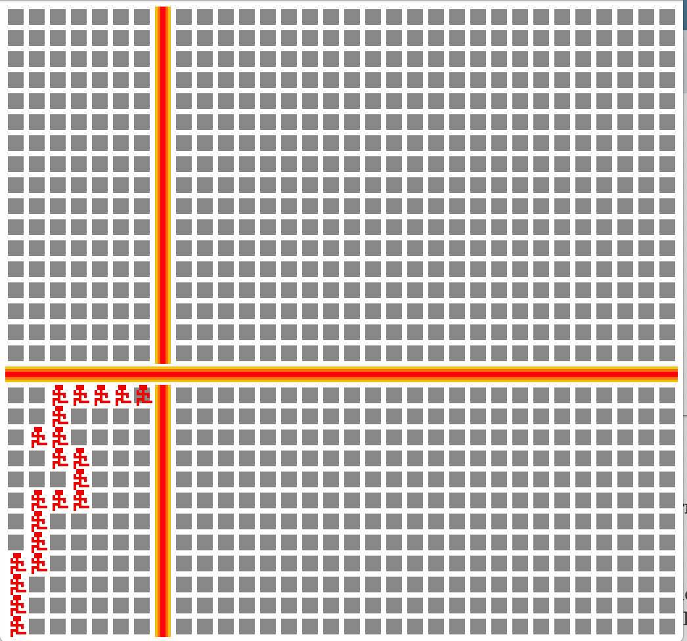

# 20 second run

Author: Jianrong Yu

Design: This is a grid runner. There's fire in your way constantly. Try to avoid fire. See how far you can run in 20 seconds!

Screen Shot:

How Your Asset Pipeline Works:

data/. All the images are in data/. Those include backgroundpixel.png, burnt.png, character.png, horfire.png and verfire.png. Each is one tile.

write_sprites.cpp. By running sprites/write_sprites, pngs files are read in from data/ and processed. 
Then chunks (basically tile and their corresponding palette) and their names are produced in sprites.cnk.
                   
SpriteCnk.hpp/cpp. This is the asset loader and is called in PlayMode.cpp. The chunks are read in gloabally in PlayMode.cpp and then loaded into the tile_table/palette_table in the constructor.

How To Play:
Basic directional keys to control your character. Stepping on fire means game over immediately. Be cautious, make sure you don't step on fire and at the same time run as fast as possible.

The four borders are the best path because they have at most one fire and sometimes no fire but obviously once there's fire in the way you gotta change direction. You can't go across the map by going down from the edge either.

The game is about how many trails the player left so going back and forth would not increase score.

Sources: All created by myself.

This game was built with [NEST](NEST.md).

